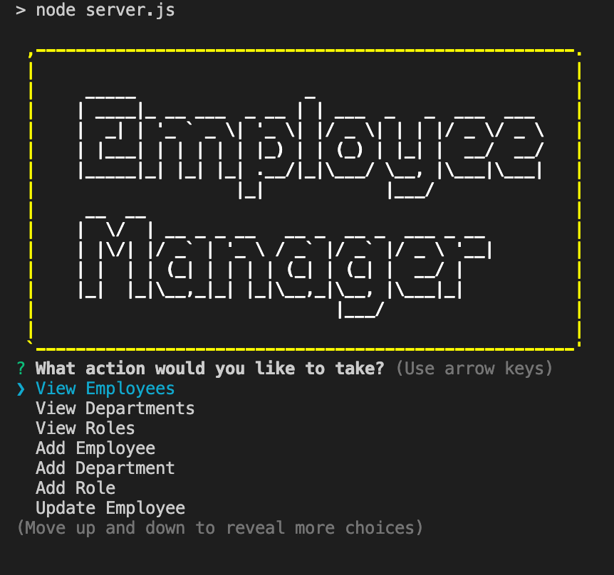
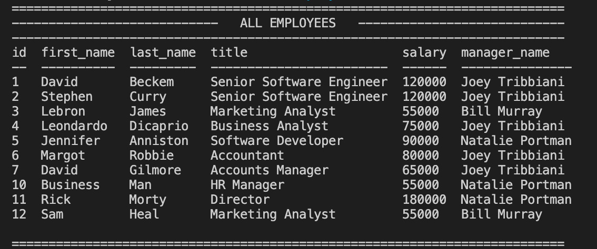

 https://opensource.org/licenses/ISC
  
  # Employee Manager
  
  ## Description:
  This project required me to utilise mySQL and node.js to build a program that could store employee details, as well as add employees, departments and roles, as well as update employee roles.
  
  ## Table of contents:
  - [Installation](#installation)
  - [Usage](#usage)
  - [Contribution](#contribution)
  - [Test](#test)
  - [License](#license)
  - [Images](#images)
  - [Questions](#questions)

  ## Installation
  There are several dependencies required for this program. Inquirer, mySQL, console.table and dotenv are all needed. Please use the command 'npm i' in your terminal to install all dependencies

  ## Usage
  Free to use

  ## Contribution
  Contribute as you see fit

  ## Test
  n/a

  ## License
  ISC

  ## Images
  
  

  ## Questions
  Github: https://github.com/SamuelHeal
  Email: samuelheal@hotmail.com
  
